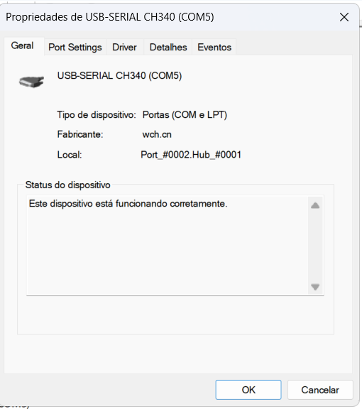

# Como rodar este projeto no Docker

## 1. Baixe o projeto do GitHub
Se ainda não baixou/clonou o projeto, rode no terminal:
```powershell
git clone https://github.com/TyagoAlves/CaixaD-aguaSmart.git
cd CaixaD-aguaSmart
```

---

## Importante: Docker Desktop precisa estar aberto no Windows!
Se você está no Windows, é obrigatório abrir o aplicativo "Docker Desktop" e aguardar até aparecer "Docker Desktop is running" antes de rodar qualquer comando Docker. Caso contrário, o Docker não será reconhecido pelo terminal.

Se aparecer erro como:
```
ERROR: error during connect: Head "http://%2F%2F.%2Fpipe%2FdockerDesktopLinuxEngine/_ping": open //./pipe/dockerDesktopLinuxEngine: O sistema não pode encontrar o arquivo especificado.
```
Isso significa que o Docker Desktop não está aberto ou inicializado. Abra o Docker Desktop e tente novamente.

---

Este projeto já vem pronto para ser usado em um container Docker com PlatformIO e todas as dependências para ESP8266/Arduino.

## Pré-requisitos
- Ter o [Docker](https://www.docker.com/products/docker-desktop/) instalado no seu computador.

## Passos para rodar

1. **Abra o terminal na pasta do projeto**

2. **Construa a imagem Docker:**
```sh
docker build -t esp8266-pio .
```

3. **Rode o container com acesso à porta USB (para upload no ESP):**
   - No Windows (PowerShell):
> Primeiro, descubra qual porta COM seu ESP está usando (exemplo: COM5). Você pode ver isso no Gerenciador de Dispositivos do Windows, em "Portas (COM e LPT)". Veja o exemplo da imagem abaixo:
>
> 

> Exemplo para COM5:
```powershell
docker run -it --rm --device=COM5 -v "${PWD}:/workspace" esp8266-pio
```
   - No Linux, rode:
```sh
docker run -it --rm --device=/dev/ttyUSB0 -v $(pwd):/workspace esp8266-pio
```
   - (No Windows, o upload direto para o ESP pode não funcionar via Docker, mas você pode compilar normalmente e copiar o firmware para gravar fora do container.)

# Observação importante para Windows:
> Se o caminho da sua pasta tiver espaços (ex: `C:\Users\tyago\OneDrive\Área de Trabalho\arduino teste\CaixaD-aguaSmart`),
> o comando do Docker pode dar erro de formato. Use aspas duplas no parâmetro -v:
```powershell
docker run -it --rm -v "${PWD}:/workspace" esp8266-pio
```

4. **Dentro do container, compile e faça upload normalmente:**
```sh
platformio run           # Compila
platformio run -t upload # Faz upload (se USB disponível)
```

5. **Para abrir um shell no container:**
```sh
docker run -it --rm -v ${PWD}:/workspace esp8266-pio
```

## Observações
- O código-fonte do projeto fica sincronizado entre o host e o container.
- Se precisar instalar mais bibliotecas, use `platformio lib install <nome>` dentro do container.
- Para rodar scripts PowerShell de automação (gitpush.ps1), rode-os no Windows, não dentro do container.

---
Dúvidas? Só perguntar!
